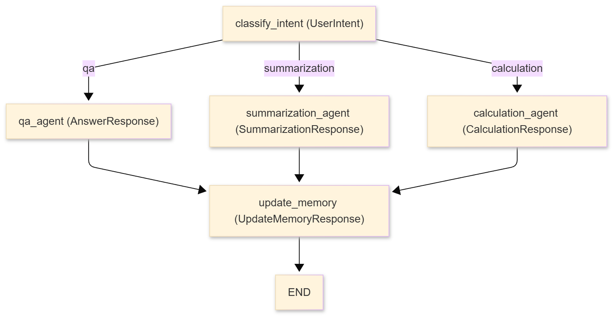

## DocDacity Document Assistant

A LangChain + LangGraph, intent-routed document assistant. It classifies user intent (Q&A, summarization, calculation), routes to specialized agents, retrieves and reads financial/healthcare documents, performs calculations via a guarded calculator tool, and maintains conversation memory across turns.

### Project Layout
- `starter/` – runnable CLI implementation (use this to run and test).
- `docs/` – additional diagrams (e.g., `docs/workflow.mmd` Mermaid graph).

### Setup
From `report-building_agent/starter`:
1) Python 3.9+ recommended.
2) Create/activate a venv: `python -m venv .venv && source .venv/bin/activate` (Windows: `.venv\Scripts\activate`).
3) Install deps: `pip install -r requirements.txt`.
4) Configure `.env`: copy `.env.example` to `.env` and set `OPENAI_API_KEY`. The VOC endpoint is already set in code (`https://openai.vocareum.com/v1`).
5) Run: `python main.py`.

### Architecture and Routing

- **Router**: `classify_intent` calls the LLM with conversation history + user input, enforcing `UserIntent` structured output.
- **Intent map**:
  - `qa` → `qa_agent`
  - `summarization` → `summarization_agent`
  - `calculation` → `calculation_agent`
  - default → `qa_agent`
- **Task nodes**: Build an intent-specific prompt, call a ReAct agent with the matching structured schema, log tools used.
- **Memory node**: `update_memory` summarizes the turn (`UpdateMemoryResponse`), merges active document IDs, and sets `next_step = end`.
- **Reducer**: `actions_taken` uses `operator.add` to accumulate node names for traceability.
- **Diagram**: see `docs/workflow.mmd` (Mermaid) or paste the block below into a renderer:

### State, Memory, Structured Outputs
- **State fields**: `user_input`, `messages`, `intent`, `next_step`, `conversation_summary`, `active_documents`, `current_response`, `tools_used`, `session_id`, `user_id`, `actions_taken`.
- **Schemas**: `UserIntent`, `AnswerResponse`, `SummarizationResponse`, `CalculationResponse`, `UpdateMemoryResponse` enforce types, confidence bounds, and required fields.
- **Persistence**: LangGraph `InMemorySaver` checkpointer keyed by `thread_id` (session_id) + session JSON files under `sessions/`. Memory summaries keep follow-up turns grounded without rereading every doc.
- **Logging**: Every tool call is JSON-logged to `logs/` with timestamp, input, output/error.

### Tools (core behaviors)
- `calculator`: Validates basic math expressions, executes in a safe namespace, returns strings; all math must use this tool.
- `document_search`: Keyword/type/amount-aware search over the bundled sample documents (supports over/under/between/approximate).
- `document_reader`: Reads full content by document ID (includes basic metadata).
- `document_statistics`: Collection-level stats (counts, totals, averages).

### Prompts
- Intent-specific system prompts (QA, summarization, calculation). The calculation prompt explicitly requires: read relevant docs, derive an expression, and call the calculator tool for all math (no mental arithmetic). Chat prompts include prior `chat_history` for continuity.

### Usage Examples (try these in the CLI)
- Q&A: `What's the total amount in invoice INV-001?`
- Summarization: `Summarize all contracts`
- Calculation: `Add totals for all invoices`
- Filtering: `Find documents with amounts over $50,000`
- Memory check: ask a follow-up like `What was that total again?` after a prior invoice question.

### Running, Sessions, Logging
- Start: `python main.py`.
- Resume: when prompted, enter a prior session ID to restore state from the checkpointer and session file.
- Artifacts: `sessions/<session_id>.json`, `logs/tool_usage_<timestamp>.json`.
- Full transcript: `script -af session.log` (WSL/bash) before running `python main.py`.

### Testing and Validation Ideas
- Routing: send one QA, one summarization, one calculation prompt; confirm intent classification and `actions_taken` path.
- Tooling: simple math (`2+2`) to force calculator; malicious expression to confirm validation error.
- Memory: follow-up question referencing prior doc to ensure summaries/active docs are reused.
- Persistence: restart and resume the same session ID; verify history and summaries are present.

### Design Notes
- Uses `langchain_core` prompt imports for LangChain 1.x compatibility.
- Strict structured outputs replace brittle parsing.
- Conservative default routing to QA.
- Actions + tool logs provide auditability and debugging hooks.

### License
[License](../LICENSE.md)
